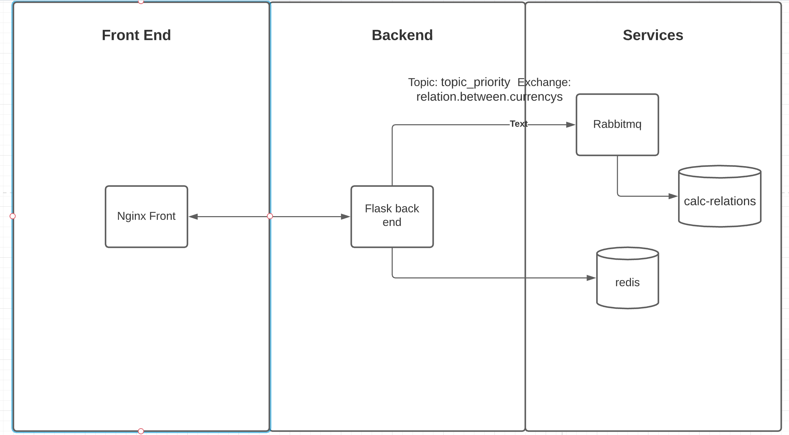

# API Desafio Cortex 1

## Arquitetura



## API deve retornar a cotação das moedas.
A api toma como base os dados oriundos da BCB (Banc) api **https://olinda.bcb.gov.br/olinda/servico/PTAX/versao/v1/odata/** . Os dados providos por essa api são manipulados por um servico chamado ServiceQuoteCurrencyPrice, que retorna a conversão de uma moeda para outra baseada na cotacao atual das moedas.

## 1 Ambientes em backend

O projeto é possui somente o ambiente de prod.Para test foi usado outra configuração. Afim de simplificar a solucão não foi criado ambientes de BETA e DEV. Ambas configurações se encontram no arquivos settings. 


### 1.2 Prod

```
http://127.0.0.1:80
````
No ambiente em prod usa se o cache redis e rabbimq em imagens separadas que só podem ser visualizadas pela imagem flask. O docker-compose sobe uma app que possui os containers **flask , redis , rabbitmq e webserver** . O serviço web  é uma imagen com nginx, ela foi alterada afim de obter aumento de desempenho. Suas confs se encontram na pasta nginx, onde existe o Dockerfile reponsavel pela criacao da imagem e uma pasta conf.d com os seguintes arquivos:

- conf.d:
   - app.conf
   - http.conf
   - nginx.conf

Foi adicionado na location configuração de stale cache e de proxy lock on. Exitem dois headers que retornam a informações de cache  **X-Cache-Status** e **X-CACHE-KEY**, informando o status do cache e o path cacheado

## Endpoints

|Método|Rotas |Query String | Parametros | Body
|------|------------|-----------------------|-----------|-------|
|GET |/healthcheck|- |-| -|
|GET |/currency |`from{value}&to{value}&initial_date={value}&final_date={value}&amount{value}&priority{value}`|-|-|

Os campos  **from, to, initial_date, final_date, amount** são obrigatórios, somente o campo priority que não é 

## Cache 

A aplicação possui dois nives de cache, um de FE e outro de BE . O de FE é provido pelo nginx e serve um stale caso aja algum problema no servidor de BE, e um cache 30m de http code 200 e 10m para 404. O de BE é provido pelo redis ele cacheia o informacao da relacao dos valores da moeda que saão necessaria para fazer o calculo da conversão esse cache é chamado pelo Consumer que realiza a computacao a partir dos parametros dos simbolos das moedas e o periodo solicitado. Uma boa opção seria limitar o tamanho do amount. Entretanto, neste caso existe a questão da dualidade entre dominio do negocio e performance. Nesse cenario, quanto maior é o tempo de cache(range maior de valores cacheados), mais distante o valor é da realidade.

Cache no front Respondera com um header de Miss caso seja um conteudo live e hit caso seja cachedo no nginx. Exemplo:
```
http://127.0.0.1:80/currency?from=GBP&to=JPY&initial_date=11-26-2020&final_date=11-26-2020&amount=1 
```

``` 
Headers 
X-Cache-Status : MISS
X-CACHE-KEY: http://127.0.0.1/currency?from=GBP&to=JPY&initial_date=11-26-2020&final_date=11-26-2020&amount=1
```

```
http://127.0.0.1:80/currency?from=GBP&to=JPY&initial_date=11-26-2020&final_date=11-26-2020&amount=2
```

``` 
{
    "status": "HIT",
    "results": [
        {
            "valor_convertido": 139.1572154868987,
            "dataHoraCotacao": "2020-11-26 10:11:18.759"
        }, ...
    ]
} 
```

### RabbitMQ 

O uso do rabbimq se da a necessidade do uso de fila de prioridade neste caso a chave é o periodo. A classe producer coloca na fila os dados necessarios e o metodo **get_relation_ratio_between_currencies_in_given_period** é chamado. Apos isso o dado é armazenado no redis por 30 min. Essa solucao diminui o vazamento do cache pq armazena todas as chamadas em um dado periodo. Essa relacao é benefica devido a chamadas com ranges de periodo muito grandes. A aplicacao por default sempre faz uma chamada live e depois insere na fila calc relations para posteriormente ser processada no comsumer. A vantagem é que determinadas chamadas podem ganhar prioridade e serem armazenadas no cache em frente a outras.Uma possivel solucao é fazer uma fila para tratar os dias isoladamente o que diminuiria a quantidade de dados repetidos no redis. Exemplo: 22-10-2019|24-10-2019 e 22-10-2019|23-10-2019 teriam um dia de dados duplicados. As chamadas seriam acessadas apartir de between desses dias.

### Especificações de Requests e Responses

   ### GET
  - Request:

    ```bash
    curl -X GET "/currency?from=GBP&to=JPY&initial_date=11-26-2020&final_date=11-26-2020&amount=2"  ou priority(query string opcional)
    ```

  - Response Body esperado:
    ``` {
        "status": "HIT",
        "results": [
            {
                "valor_convertido": 139.1572154868987,
                "dataHoraCotacao": "2020-11-26 10:11:18.759"
            }, ...
        ]
         } 
    ```

## Como executar o projeto
Para executar os arquivos makefile é necessario estar na pasta raiz do projeto

Para executar os tests:
 - ```docker-compose up -d --build testerabbitmq testeredis ```
 - ``` make install ```
 - ``` make test ```

Para executar em prod :
 - ```make prod```
 - ```make workers```
